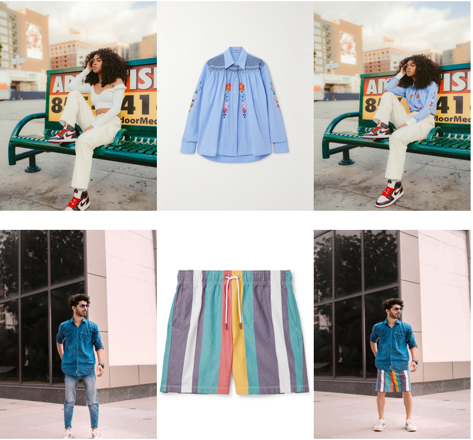
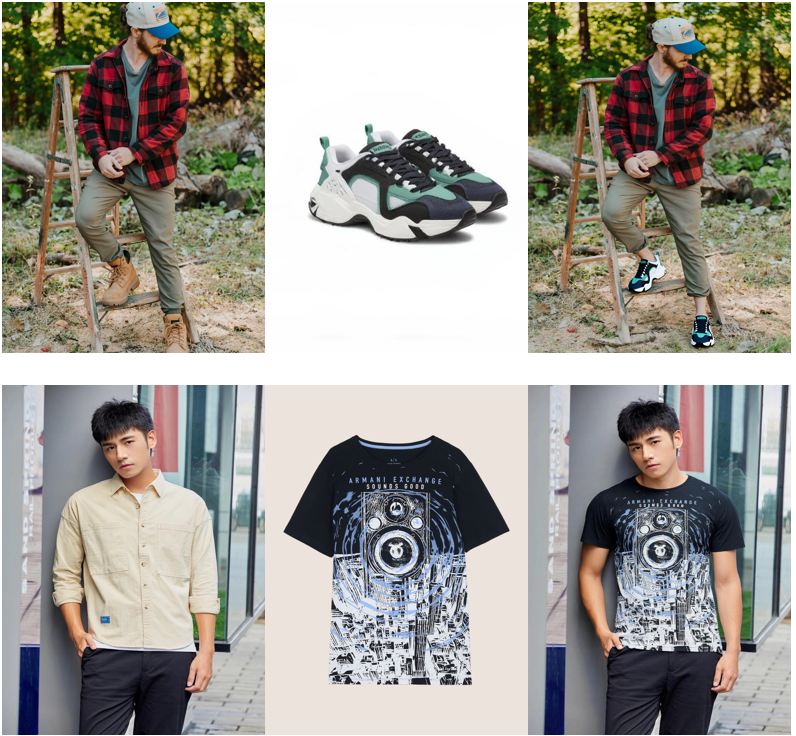
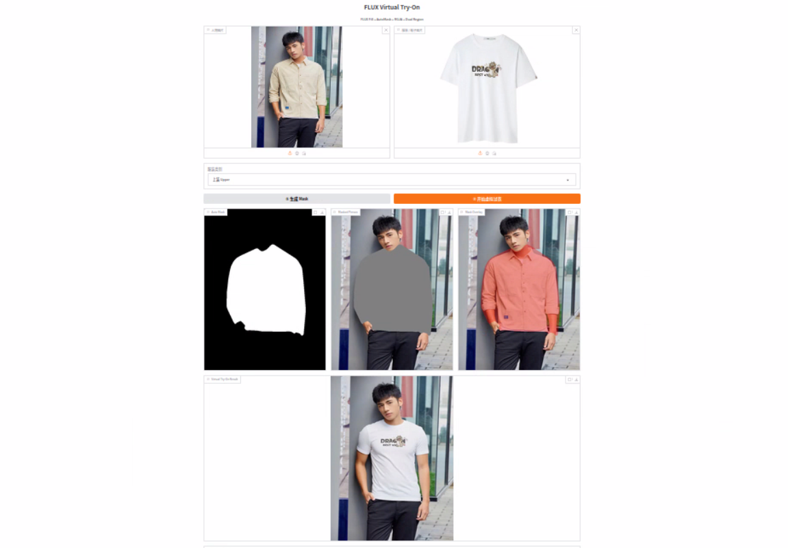

# ReGra-VTON

ReGra-VTON is a diffusion-based virtual try-on project. It supports single-image inference, a Gradio demo, training, and evaluation on VITON-HD, DressCode, and DressCode-MR.

<div align="center">
  
</div>

<div align="center">
  
</div>

## Installation

The project was developed on Linux with Python 3.10 and PyTorch 2.5.1 + CUDA 11.8.

```bash
git clone https://github.com/levelife/ReGra-VTON.git
cd ReGra-VTON

conda create -n regra-vton python=3.10 -y
conda activate regra-vton

pip install torch==2.5.1 torchvision==0.20.1 torchaudio==2.5.1 \
  --index-url https://download.pytorch.org/whl/cu118
pip install -r requirements.txt
```

## Inference

### 1. Download ReGra-VTON weights

The inference script expects a **local path** for `--transformer_path`. Download the model from [Hugging Face](https://huggingface.co/levelife/ReGra-VTON) first:

```bash
huggingface-cli download levelife/ReGra-VTON \
  --local-dir ./pretrained_models/ReGra-VTON
```

If the repository is gated or private, log in first:

```bash
huggingface-cli login
```

### 2. Prepare DensePose and SCHP

The mask-generation pipeline requires Detectron2, DensePose, and SCHP.

- [Detectron2](https://github.com/facebookresearch/detectron2)
- [DensePose](https://github.com/facebookresearch/DensePose)
- [SCHP](https://github.com/GoGoDuck912/Self-Correction-Human-Parsing/tree/master)

Download the DensePose configuration files and checkpoint from the [DensePose model zoo](https://github.com/facebookresearch/detectron2/blob/main/projects/DensePose/doc/DENSEPOSE_IUV.md#model-zoo). Put the following files in one local directory:

```text
ckpt/densepose/
├── Base-DensePose-RCNN-FPN.yaml
├── densepose_rcnn_R_50_FPN_s1x.yaml
└── model_final_162be9.pkl
```

Download the SCHP LIP and ATR checkpoints from the [SCHP project](https://github.com/GoGoDuck912/Self-Correction-Human-Parsing/tree/master) and place them in another local directory:

```text
ckpt/schp/
├── exp-schp-2019082611-lip.pth
└── exp-schp-2019083015-atr.pth
```

### 3. Run inference

Replace every quoted path below with its actual local path. `--person` is the input person image, `--garment` is the garment image, and `--out` is the generated result path.

```bash
export CUDA_VISIBLE_DEVICES=0

python infer.py \
  --person "person path" \
  --garment "garment path" \
  --part lower \
  --height 1024 --width 768 \
  --transformer_path "./pretrained_models/ReGra-VTON" \
  --pretrained_inpaint_model_name_or_path black-forest-labs/FLUX.1-dev \
  --densepose_ckpt_dir "./ckpt/densepose" \
  --schp_ckpt_dir "./ckpt/schp" \
  --steps 50 \
  --guidance_scale 20 \
  --dtype bf16 \
  --max_sequence_length 256 \
  --out "output path" \
  --save_mask "save mask path" \
  --save_inputs_dir "save path"
```

Valid values for `--part` are `upper`, `lower`, `overall`, and `shoe`. The command above is the same workflow as `infer.sh`, with local paths filled in as examples.

## Gradio Demo

Set the local model paths in `gradio.py`:

```python
DEFAULT_TRANSFORMER_DIR = "./pretrained_models/ReGra-VTON"
DEFAULT_DENSEPOSE_DIR = "./ckpt/densepose"
DEFAULT_SCHP_DIR = "./ckpt/schp"
```

Then start the demo:

```bash
python gradio.py
```

<div align="center">
  
</div>

## Training

### 1. Datasets

This project supports the following datasets. Download them from their official sources and comply with each dataset's license. Do not redistribute their images or annotations in this repository.

- [VITON-HD](https://github.com/shadow2496/VITON-HD)
- [DressCode](https://github.com/aimagelab/dress-code)
- [DressCode-MR](https://github.com/Zheng-Chong/FastFit)

### 2. Base models

Training uses [FLUX.1-dev](https://huggingface.co/black-forest-labs/FLUX.1-dev) and the inpainting base model [levelife/basemodel](https://huggingface.co/levelife/basemodel). The training code loads these Hugging Face repositories through `from_pretrained`, so they download automatically when public and available to your account.

For private or gated repositories, run:

```bash
huggingface-cli login
```

### 3. Run training

Edit `--dataroot`, the JSON/JSONL list paths, and `--output_dir` before running. Set `--dataset_name` to one of `viton-hd`, `dresscode`, or `dresscode-mr`.

```bash
export CUDA_VISIBLE_DEVICES=0,1
export OFFLOAD_TEXT_ENCODERS=1
export PROMPT_CACHE_MAX=8
export DEEPSPEED_TIMEOUT=3600
export NCCL_ASYNC_ERROR_HANDLING=1
export NCCL_BLOCKING_WAIT=1

accelerate launch --config_file accelerate_config.yaml train.py \
  --pretrained_model_name_or_path "black-forest-labs/FLUX.1-dev" \
  --pretrained_inpaint_model_name_or_path "levelife/basemodel" \
  --dataroot "dataset path" \
  --dataset_name "dresscode-mr" \
  --train_data_list "train.json" \
  --train_verification_list "test.jsonl" \
  --validation_data_list "test.jsonl" \
  --output_dir "output path" \
  --height 512 \
  --width 384 \
  --train_batch_size 1 \
  --gradient_accumulation_steps 8 \
  --optimizer "adamw" \
  --use_8bit_adam \
  --learning_rate 5e-7 \
  --max_train_steps 15000 \
  --checkpointing_steps 2000 \
  --validation_steps 2000 \
  --gradient_checkpointing \
  --allow_tf32 \
  --region_loss_lambda 1.0 \
  --report_to "wandb" \
  --seed 42 \
  --prompt_mode dataset \
  --prompt_dropout_prob 0.1 \
  --edit_region_loss_lambda 0.5 \
  --train_base_model
```

## Evaluation

```bash
python eval.py \
  --gt_folder "ground-truth image folder" \
  --pred_folder "generated image folder" \
  --paired \
  --batch_size 8 \
  --num_workers 8
```

Remove `--paired` for unpaired evaluation.

## Acknowledgement

Our code is built with [Diffusers](https://github.com/huggingface/diffusers). We adopt [FLUX.1-dev](https://huggingface.co/black-forest-labs/FLUX.1-dev) and [levelife/basemodel](https://huggingface.co/levelife/basemodel) as base models. We use [SCHP](https://github.com/GoGoDuck912/Self-Correction-Human-Parsing/tree/master) and [DensePose](https://github.com/facebookresearch/DensePose) to automatically generate masks for inference and the [Gradio](https://github.com/gradio-app/gradio) demo. Thanks to all contributors!

## Citation

If you find this repository useful, please cite:


```bibtex
@inproceedings{choi2021vitonhd,
  title={VITON-HD: High-Resolution Virtual Try-On via Misalignment-Aware Normalization},
  author={Choi, Seunghwan and Park, Sunghyun and Lee, Minsoo and Choo, Jaegul},
  booktitle={Proceedings of the IEEE/CVF Conference on Computer Vision and Pattern Recognition},
  year={2021}
}

@inproceedings{morelli2022dresscode,
  title={Dress Code: High-Resolution Multi-Category Virtual Try-On},
  author={Morelli, Davide and Fincato, Matteo and Cornia, Marcella and Landi, Federico and Cesari, Fabio and Cucchiara, Rita},
  booktitle={Proceedings of the European Conference on Computer Vision},
  year={2022}
}

@misc{chong2025fastfit,
  title={FastFit: Accelerating Multi-Reference Virtual Try-On via Cacheable Diffusion Models},
  author={Chong, Zheng and Lei, Yanwei and Zhang, Shiyue and He, Zhuandi and Wang, Zhen and Zhang, Xujie and Dong, Xiao and Wu, Yiling and Jiang, Dongmei and Liang, Xiaodan},
  year={2025},
  eprint={2508.20586},
  archivePrefix={arXiv}
}

```

## License

The source code in this repository is released under the
[Apache License 2.0](LICENSE).

The ReGra-VTON and base-model checkpoints are distributed separately via
Hugging Face and remain subject to their respective model licenses.
VITON-HD, DressCode, and DressCode-MR are not redistributed by this repository
and remain subject to their original terms of use.